# ino-rc6502-raccoon 🦝

[](https://www.arduino.cc/)
[](https://store.arduino.cc/products/arduino-nano)
[](https://github.com/neoelec/ino-rc6502-raccoon)
[](LICENSE.txt)

**`ino-rc6502-raccoon`** is an advanced, high-performance Parallel I/O (PIO) controller firmware and peripheral expansion suite for the **RC6502 Apple 1 Replica** computer. Running on an **Arduino Nano (ATmega328P)**, it transforms serial communication into hardware-synchronized Apple 1 keyboard/video signals, generates an on-board 1MHz system clock, controls CPU reset lines, and provides a Micro-SD card program loader with an interactive serial menu.

---

## 🌟 Key Features

- **Dual Operational Modes**:
  - **Classic Mode**: Standard PIO terminal relay without hardware modifications.
  - **Modded Mode**: Full-featured mode with Micro-SD card storage, on-board 1MHz clock generator, hardware reset control, and interactive menu.
- **Hardware-Generated 1MHz System Clock & Reset**:
  - Replaces the external 1MHz crystal oscillator (X14) using Timer1 CTC mode (`OCR1A = 7`, 1MHz square wave on D9).
  - Software-controlled CPU hardware reset pulse generation (D8) with pull-up auto-release.
- **Dual Interrupt-Driven Keyboard & Video Handshake**:
  - Full hardware interrupt synchronization (`INT0` on D2 for Keyboard Clear, `INT1` on D3 for Video Data Available) with state machines for reliable timing without character drops.
- **Multi-Format Micro-SD Program Loader (Petit FatFs)**:
  - Rapid, automated program injection into 6502 memory for Woz Monitor format HEX and BASIC listings.
  - **On-The-Fly Binary Conversion (`Type::Bin`)**: Directly streams raw 6502 machine code binaries (`.bin`) from SD card into Woz Monitor format (`<ADDR>: XX XX ...\r`), saving up to 73% SD card storage.
  - Categorized CSV catalog indexing (`PGMxxx.CSV`) with metadata (Program Name, Type, Load Address, Run Address).
- **Interactive Serial Console Menu (`Ctrl+R`)**:
  - Built-in command shell for directory switching, paginated program listing, one-key program loading, warm resetting, and PIO watchdog reset.
- **Multi-Bank Custom ROM Integration**:
  - Full support for bank-switched ROMs containing Integer BASIC, Krusader Assembler, Apple-II Monitor, Ohio Scientific BASIC, AppleSoft BASIC Lite, and Woz Monitor.

---

## 🏗️ System Architecture

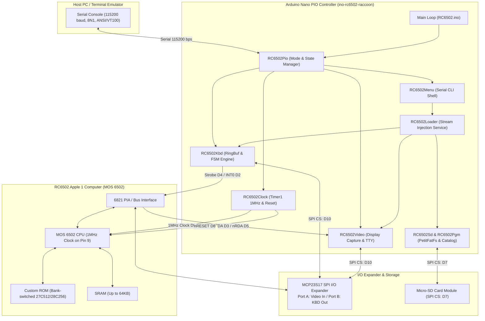


### Keyboard Strobe & Handshake FSM

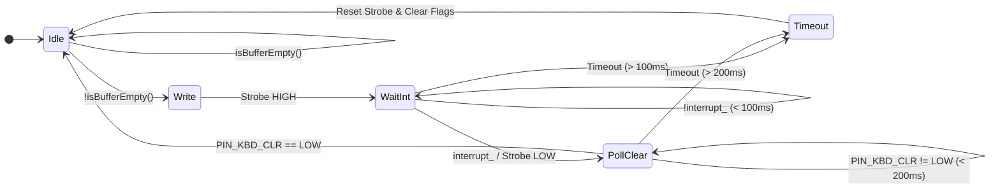

---

## ⚡ Performance & Architectural Highlights

- **Multi-Format Polymorphic Loader**: Dynamically supports direct ASCII streaming (`Type::Hex`) and on-the-fly binary formatting (`Type::Bin`) with zero memory allocation.
- **Pipelined Stream Injection**: SD file data streams directly through a 64-byte RingBuffer pipeline without blocking per-character empty waits, keeping the 6821 PIA transmission line fully saturated.
- **128-Byte SD Chunk Buffer**: Enlarged SD sector read buffer reduces Petit FatFs `CMD17` SPI block transactions by 50%.
- **8MHz Hardware SPI Acceleration**: Uses maximum AVR SPI clock speed (`SPI_CLOCK_DIV2`, 8MHz) with [ino-PetitFatFs-raccoon](https://github.com/neoelec/ino-PetitFatFs-raccoon) for 2x storage throughput.
- **Fast File Open**: Direct root directory file traversal eliminates redundant filesystem re-mounts with automated fallback recovery.
- **Non-Blocking Interrupt-Driven Video/Keyboard Handshake**: Fully compliant with the 1MHz MOS 6502 / 6821 PIA timing specifications.
- **Hardened FSM Safeguards**: 100ms and 200ms timeout guards prevent firmware freeze if the target 6502 CPU halts.
- **Watchdog Bootloop Protection**: Early `MCUSR` clear and `wdt_disable()` prevents infinite reboot loops on legacy Arduino bootloaders.
- **Clean Decoupled Architecture**: Scoped enums (`enum class`), single-responsibility `RC6502Loader`, and encapsulated auto-detect `RC6502Pio.begin()`.

---

## 🔌 Hardware Modification & Pin Mapping

### Arduino Nano Pinout

| Pin | Function / Constant | Direction | Connected To | Description |
| :--- | :--- | :---: | :--- | :--- |
| **D2** | `PIN_KBD_CLR` | INPUT | 6821 PIA / KBD Ready | `INT0` External interrupt for keyboard handshake |
| **D3** | `PIN_VIDEO_DA` | INPUT | 6821 PIA / Video DA | `INT1` External interrupt for Video Data Available |
| **D4** | `PIN_KBD_STR` | OUTPUT | 6821 PIA / KBD Strobe | Keyboard Data Available strobe |
| **D5** | `PIN_VIDEO_nRDA` | OUTPUT | 6821 PIA / Video nRDA | Video Read Data Acknowledge |
| **D7** | `PIN_SD_nSS` | OUTPUT | Micro-SD Card Module | SPI Chip Select for SD card |
| **D8** | `PIN_nRESET` | OUTPUT (Hi-Z) | 6502 CPU `nRESET` | Hardware Reset line (pulled low during reset) |
| **D9** | `PIN_CLK_1MHZ` | OUTPUT | 6502 CPU `CLK` / X14 | Timer1 OC1A 1MHz square wave clock |
| **D10** | `PIN_MCP23S17_nSS`| OUTPUT | MCP23S17 Expander | SPI Chip Select for MCP23S17 |
| **D11** | `SPI MOSI` | OUTPUT | MCP23S17 / Micro-SD | Shared SPI Master Out Slave In |
| **D12** | `SPI MISO` | INPUT | MCP23S17 / Micro-SD | Shared SPI Master In Slave Out |
| **D13** | `SPI SCK` | OUTPUT | MCP23S17 / Micro-SD | Shared SPI Serial Clock |
| **A7** | `PIN_PIO_MODE` | INPUT (Analog) | Mode Select Switch | $\le 512$: Classic Mode, $> 512$: Modded Mode |

### MCP23S17 Expander Pin Mapping

| Port | Pins | Direction | Description |
| :--- | :--- | :---: | :--- |
| **Port A** | `GPA0 ~ GPA6` | INPUT | Video Output 7-bit ASCII Data (`RC6502 -> Arduino`) |
| **Port B** | `GPB0 ~ GPB6` | OUTPUT | Keyboard Input 7-bit ASCII Data (`Arduino -> RC6502`) |
| **Port B** | `GPB7` | OUTPUT | Keyboard Data Available Flag (High bit `0x80`) |

### Hardware Modification Steps

1. **Remove 1MHz Clock Oscillator (`X14`)**:
   - De-solder and remove the standalone 1MHz oscillator `X14`.
   - Install the **Micro-SD Card Slot** and **3.3V Level Shifter** in this space.
2. **Clock Line Connection**:
   - Connect Arduino Nano **Pin 9** (`PIN_CLK_1MHZ`) to the RC6502 main board `CLOCK` line (a 10 $\Omega$ series resistor is recommended).
3. **Reset Line Connection**:
   - Connect Arduino Nano **Pin 8** (`PIN_nRESET`) to the 6502 CPU `RESET` line.
4. **Micro-SD Card Module Wiring**:
   - Connect SPI lines (`MOSI: D11`, `MISO: D12`, `SCK: D13`, `CS: D7`, `VCC: 5V`, `GND`) via the 3.3V level shifter.

### Modification Photos

| Overview | Clock & Reset Wiring |
| :---: | :---: |
| 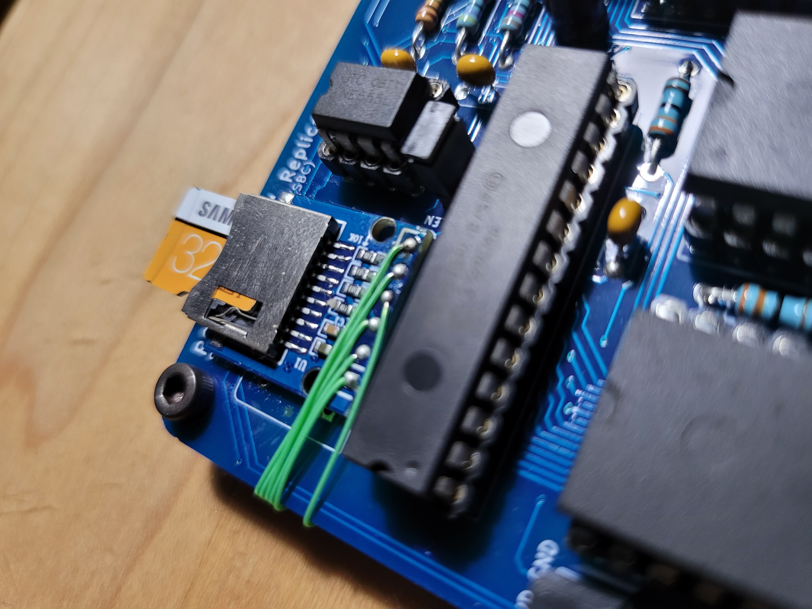 | 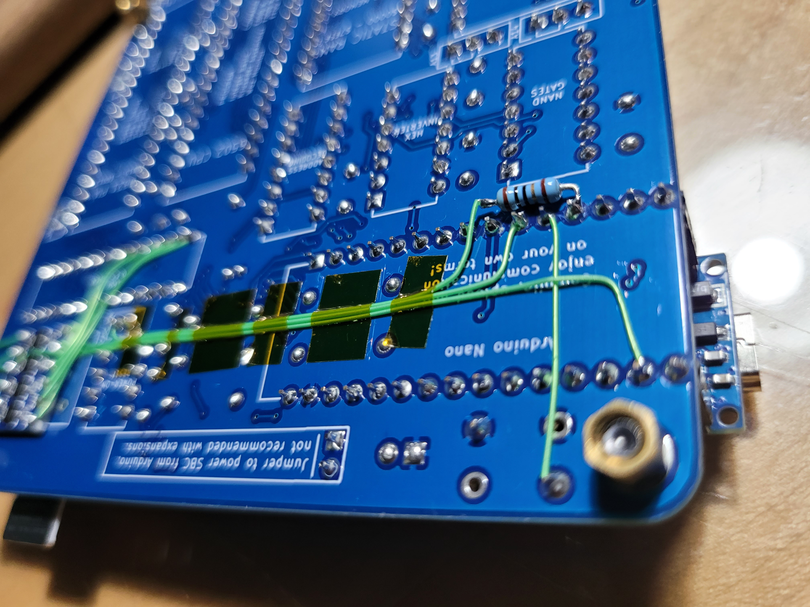 |
| **SD Module & Level Shifter** | **Installed Board Bottom** |
| 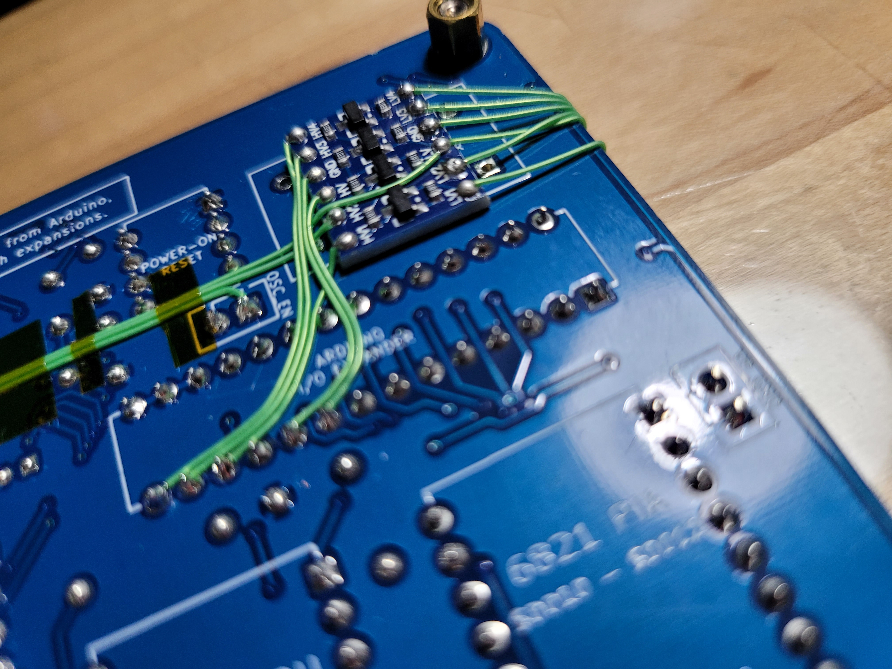 | 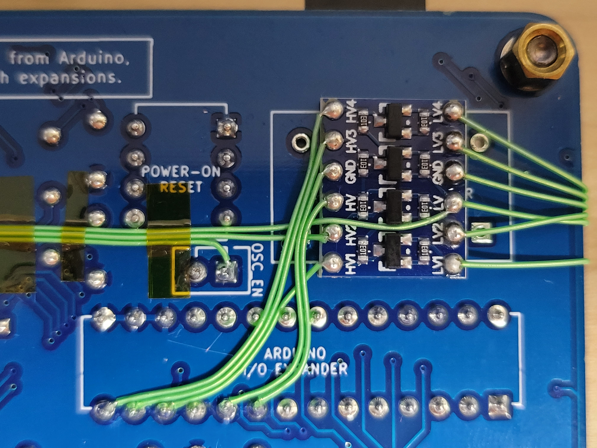 |

---

## 🚀 Quick Start & Usage

### 1. Prerequisites & Required Libraries

Install the following libraries in your Arduino IDE / CLI environment:
- **[ino-PetitFatFs-raccoon](https://github.com/neoelec/ino-PetitFatFs-raccoon)** (Hardware SPI 8MHz Petit FatFs wrapper)
- **Adafruit MCP23017 Arduino Library** (`Adafruit_MCP23X17.h`)
- **RingBuffer** (`RingBuf.h`)

### 2. Building and Uploading

Open [`examples/RC6502/RC6502.ino`](examples/RC6502/RC6502.ino) in the Arduino IDE:
1. Select Board: **Arduino Nano**
2. Select Processor: **ATmega328P** (or ATmega328P Old Bootloader)
3. Compile and Upload.

```cpp
#include <rcnRC6502.h>

void setup(void)
{
  RC6502Pio.begin();
}

void loop(void)
{
  RC6502Pio.run();
}
```

### 3. Serial Terminal Connection

Connect via any serial terminal emulator (e.g. Minicom, PuTTY, screen, miniterm):
- **Baud Rate**: `115200`
- **Data Bits**: `8`
- **Parity**: `None`
- **Stop Bits**: `1`
- **Flow Control**: `None`

### 4. Interactive Console Menu (`Ctrl+R`)

Press <kbd>Ctrl</kbd> + <kbd>R</kbd> at any time in the terminal to enter the Raccoon Menu:

```text
-?
s - Select Directory
l - List Programs
o - Load Program
x - Exit
p - PIO Reset
w - Warm Reset
? - Help
-
```

| Command | Action | Description |
| :---: | :--- | :--- |
| `s` | **Select Directory** | Switch directory category (`00`, `01`, `02`, etc.) |
| `l` | **List Programs** | List available programs in current directory (paginated, 20 per page) |
| `o` | **Load Program** | Enter program number to automatically inject into 6502 memory |
| `w` | **Warm Reset** | Pulse 6502 hardware reset line and reset I/O expander |
| `p` | **PIO Reset** | Trigger Arduino watchdog timer (`WDTO_15MS`) to reboot PIO firmware |
| `x` | **Exit** | Exit menu and return to 6502 terminal mode |
| `?` | **Help** | Display command menu list |

---

## 💾 Storage Catalog & Custom ROM Banks

### SD Card Contents Organization

- **`contents/00/`**: Machine code binaries, assemblers, monitors, and languages:
  - *Apple 30th Anniversary, UltraForth-83, Krusader, Microchess, Disassembler, EhBASIC, TinyBASIC, MemTest, etc.*
- **`contents/01/`**: Integer BASIC applications and retro games:
  - *21 (Blackjack), AceyDucey, Bowling, Buzzword, Craps, Deal, Hamurabi, StarTrek, Wumpus, Slots, etc.*
- **`contents/02/`**: Extended BASIC programs:
  - *Eliza, Gomoku, Hangman, Lunar Lander, Magic Square, Matrix, Reverse, RSP, Sudoku, Tic-Tac-Toe, Yahtzee, etc.*

### ➕ Adding New Programs to SD Card (`HEX`, `BAS`, `BIN`)

To add your own programs to the SD card catalog, place the program data file in the target category folder (e.g., `contents/00/`, `contents/01/`, `contents/02/`) and create a corresponding `PGMxxx.CSV` metadata index file.

#### 1. Metadata Index File Format (`PGMxxx.CSV`)

Each program requires an index file named `PGMxxx.CSV` (where `xxx` is a 3-digit zero-padded index from `000` to `999` representing the program number):

```csv
<PROGRAM_NAME>,<TYPE>,<FILE_PATH>,<LOAD_ADDRESS_HEX>,<RUN_ADDRESS_HEX>
```

| Field | Description | Constraints & Examples |
| :--- | :--- | :--- |
| **`PROGRAM_NAME`** | Display name shown in the interactive menu | Max 23 characters (e.g., `APPLE 30TH`, `MY GAME`) |
| **`TYPE`** | Storage and stream injection format | `HEX` (Woz Hex Dump), `BAS` or `BAS/W` (BASIC Dump), `BIN` (Raw Binary) |
| **`FILE_PATH`** | Relative path to the data file on the SD card | 8.3 uppercase format (e.g., `00/APPLE30T.TXT`, `00/MCHESS.BIN`) |
| **`LOAD_ADDRESS`** | 16-bit start memory address in Hexadecimal | e.g., `0280`, `004A`, `1000` |
| **`RUN_ADDRESS`** | 16-bit entry point / run address in Hexadecimal | e.g., `0280`, `E2B3` (BASIC Warm Entry), `E000` |

---

#### 2. Supported Formats & Usage

##### A. Woz Monitor ASCII Hex Format (`Type::Hex` / `.TXT`)
* **Format**: Standard Apple 1 Woz Monitor ASCII text dump containing `<ADDR>: <HEX_BYTES>` lines.
* **Loader Mechanism**: Streams ASCII characters directly through the keyboard buffer into the Woz Monitor.
* **CSV Example**:
  ```csv
  APPLE 30TH,HEX,00/APPLE30T.TXT,0280,0280
  ```
* **Data File Example (`00/APPLE30T.TXT`)**:
  ```text
  0280: A2 0C BD 8B 02 20 EF FF
  0288: CA D0 F7 60 8D C4 CC D2
  ```
* **Execution**: In Woz Monitor, type `0280 R` (or `280R`) and press Enter.

##### B. Integer BASIC Memory Dump (`BAS` / `BAS/W` / `.TXT`)
* **Format**: Tokenized Integer BASIC program dump starting at `$004A` (Zero Page variable/program storage area) or BASIC source commands.
* **Loader Mechanism**: Streams text directly into memory via Woz Monitor.
* **CSV Example**:
  ```csv
  21,BAS/W,01/21.TXT,004A,E2B3
  ```
* **Data File Example (`01/21.TXT`)**:
  ```text
  004A:       00 08 00 10 CA 0E
  0050: FF FF FF FF FF FF FF FF
  ```
* **Execution**: In Woz Monitor, jump to the Integer BASIC warm-start vector `E2B3 R`, then type `RUN` or interact with the running program.

##### C. Raw 6502 Machine Code Binary (`Type::Bin` / `.BIN`)
* **Format**: Raw binary file compiled with 6502 assemblers/compilers (e.g., `ca65`/`ld65`, `vasm`, `cc65`).
* **Loader Mechanism**: `RC6502Loader` reads raw bytes directly from the SD card and dynamically formats them into Woz Monitor hex lines (`<ADDR>: XX XX ...\r`, 8 bytes per line) on-the-fly.
* **Key Benefits**: Up to **73% smaller file size** on the SD card and significantly faster transfer.
* **CSV Example**:
  ```csv
  MICROCHESS,BIN,00/MCHESS.BIN,0280,0280
  ```
* **Execution**: In Woz Monitor, type `0280 R` and press Enter.

---

#### 3. Step-by-Step Guide to Add a New Program

1. **Prepare Program File**:
   * For binary: Assemble your 6502 code to a raw `.bin` file (e.g., `vasm6502_oldstyle -Fbin -dotdir myprog.asm -o MYPROG.BIN`).
   * For Woz Hex / BASIC: Save as an ASCII `.TXT` file.
   * Copy the file to the target category folder on the Micro-SD card (e.g., `contents/00/MYPROG.BIN`).
2. **Create Index CSV**:
   * Determine the next available program number in that directory (e.g., `PGM013.CSV`).
   * Write the 5 comma-separated fields:
     ```csv
     MY COOL PROG,BIN,00/MYPROG.BIN,0280,0280
     ```
3. **Load and Run via Interactive Menu**:
   * Insert the Micro-SD card into the RC6502 Raccoon board.
   * In the serial console, press <kbd>Ctrl</kbd> + <kbd>R</kbd> to open the menu.
   * Press `s` to select directory (e.g., `0`), `l` to list programs, then `o` and enter the program number (e.g., `13`).
   * The firmware will automatically inject the code into 6502 memory and return to the Woz Monitor prompt.

### Raccoon's Custom ROM (`rom/rc6502_crom_00`)

The ROM binary image is located at [`rom/rc6502_crom_00/rc6502_crom_00.bin`](rom/rc6502_crom_00/rc6502_crom_00.bin). It provides 4 switchable ROM banks controlled via address lines **A13** and **A14**:

| A13 | A14 | Active Program Suite | Command to Run |
| :---: | :---: | :--- | :--- |
| **R** | **R** | Integer Basic<br>Krusader Assembler<br>Woz Monitor | `E000 R`<br>`F000 R`<br>`FF00 R` |
| **L** | **R** | Integer Basic<br>Apple-II Monitor<br>Woz Monitor | `E000 R`<br>`FE65 R`<br>`FF00 R` |
| **R** | **L** | Ohio Scientific Basic<br>Woz Monitor | `FD0D R`<br>`FF00 R` |
| **L** | **L** | AppleSoft Basic Lite<br>Woz Monitor | `E000 R`<br>`FF00 R` |

---

## 📸 Screenshots

| Woz Monitor Boot | Menu & Program Selection |
| :---: | :---: |
| 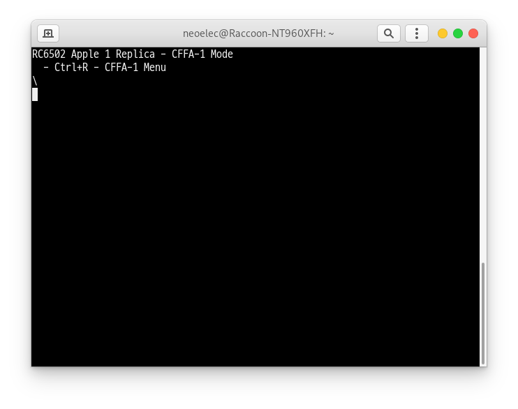 | 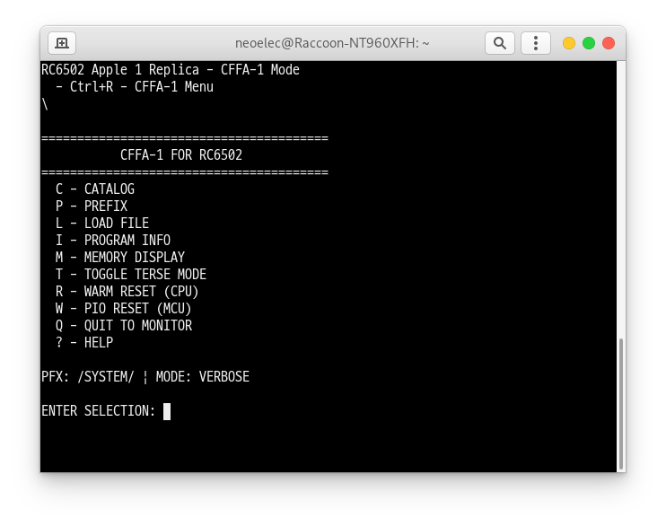 |
| **Loading Program from SD** | **Integer BASIC Execution** |
| 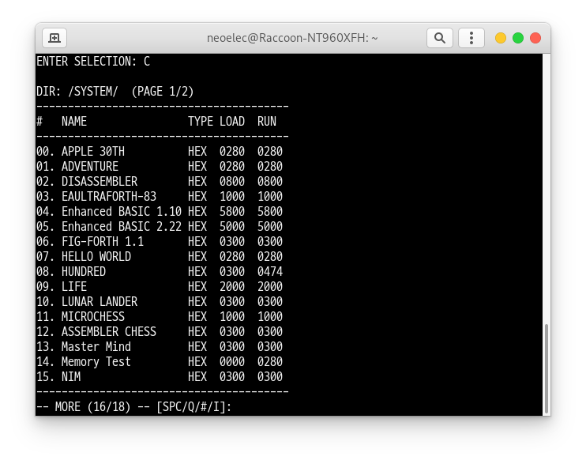 | 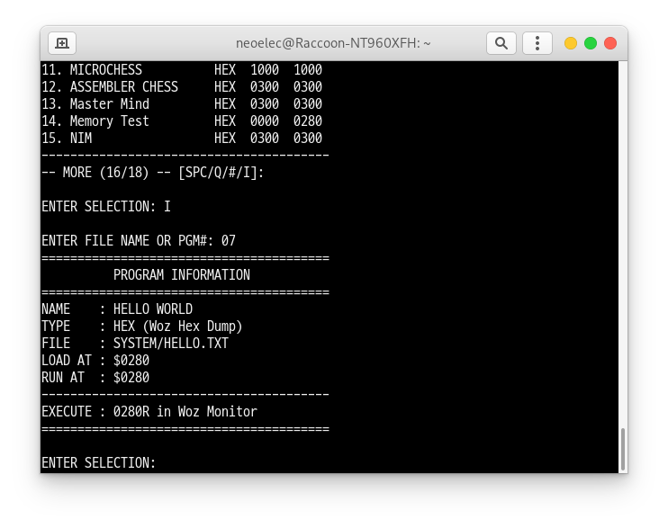 |
| **Krusader Assembler** | **Disassembler / Utilities** |
| 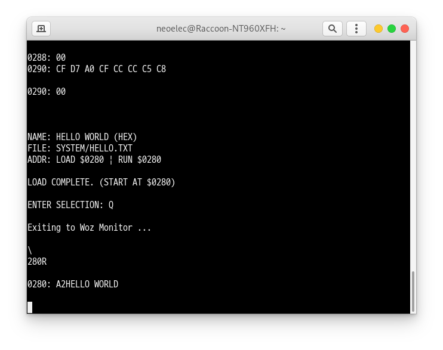 | 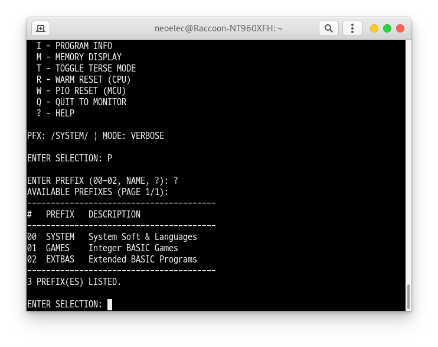 |
| **Retro Game Gameplay** | |
| 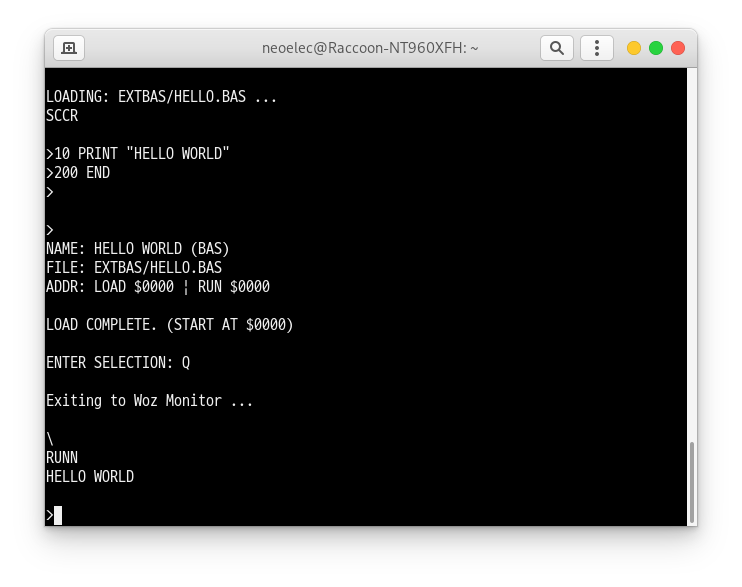 | |

---

## 📄 License

This project is licensed under the **MIT License**. See [LICENSE.txt](LICENSE.txt) for full details.
